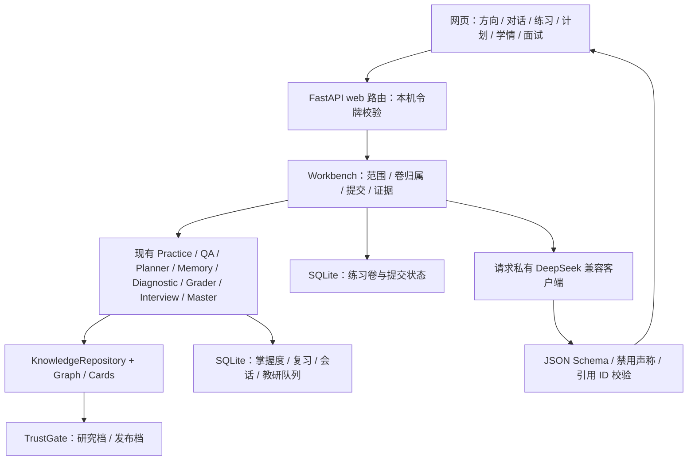

# 网页端 Agent 架构增量

2026-10-11。原八 Agent 与编排状态机保留，新增本机工作台适配层与网页。现有知识库通过唯一门面读取，模型仅叙述已检索证据和工具结果。

## 事实归属与持久化

知识门面读取真实题目、材料、CET 阅读原篇、音频绑定、考纲和规格。工作台组卷后去掉答题前的答案字段；提交必须属于该学习者的已保存练习卷。客观题以 TrustGate 对库内答案键的核对为判据，原 Memory Agent 处理归因与复习，Diagnostic Agent 汇总实际提交。主观题复用 Grader，不签署量规、不生成正式分数。疑似缺图题仅展示并拒绝提交。

`WorkbenchStore` 将练习与每次提交存入 `workbench.sqlite3`，同卷同题唯一，单进程锁串行处理 HTTP 提交。刷新恢复同时匹配学习者、考试、学段、科目和档位，并使用这份卷的提交集合。一道多考点题更新各个考点，题目作答次数只记一次。

Memory 的 `run_once` 将单个考点的画像 / 错题写入与事件回执放在同一 SQLite 事务中，回执另存一份输入指纹（`services/memory/receipt.py`）：`event_id` 说明这是哪一次作答，指纹说明那一次到底答了什么（用户、卷、题、所选答案、耗时与选项修改次数等参与归因的参数）。同一 `event_id` 同指纹原样回放，已处理的考点不重复计数；指纹不同在写入之前拒绝，接口返回 `409`。指纹上线前存下的回执没有指纹，既不回放也不重写，同样 `409`，直到本机学习记录被清空。工作台提交行按同一口径带指纹，保存失败后的重试只补写页面结果，判据仍来自第一次那次作答。前端首次提交即锁定请求参数并写入 `localStorage`，刷新后沿用原参数重试，不重新计时。两份数据库仍不是一个跨库事务，默认只运行一个 worker。现有 FSRS、会话和复核队列继续使用原存储。

Planner、Master 和 Practice 的学段科目筛选贯穿组卷、候选节点和到期复习；空池返回空结果。旧省考科目或没有规格的面试范围不退到其它科目的模考规格。日程摘要从实际任务生成。

## 模型边界

`ModelConfig.api_key` 是 `SecretStr`。前端 Key / 令牌仅保存在页面内存，每次主动问答传入；后端创建该请求的独立客户端，不修改进程环境或全局客户端。无 Key 时显式规则模式；模型错误、非法 JSON、越界引用或禁用声称都显示错误并采用真实规则结果。

模型输入为库内证据、工具结果和有限对话历史，输出 `tutor_reply` 的 `reply` 和 `citation_ids`。模型不能选择判据、覆盖掌握度、改变已生成日程、签署题库或虚构校准。调用异常和模型文本中的当前 Key 在进入输出 / 护栏队列前隐藏。Base URL 限 HTTPS 公网地址，禁止转发重定向；接口通过 `/chat/completions` 适配 DeepSeek。

研究档未签署题和自动挂载以原状态暴露；发布档在当前零具名签署题条件下关闭问答与模型调用。对未来签署内容的完整网页发布流程仍需另行接入。

## 增量接口

所有接口在 `/api/v1/web` 下，除根页和静态资源之外，沿用运行时令牌校验。

| 方法与路径 | 职责 |
| --- | --- |
| GET `/bootstrap` | DeepSeek 默认配置、范围、考点、规格和教资完整性 |
| POST `/model/test` | 真实连通性与结构化回复校验，不保存 Key |
| POST `/chat` | 问答、计划 / 练习 / 诊断意图和有证据的模型解释 |
| POST `/practice` | 保存当前学习者的真实练习卷 |
| POST `/submit` | 校验卷内题、核答案键、更新学习闭环、按输入指纹回放或拒绝（`409`） |
| POST `/profile` | 范围内画像、诊断、错题、到期题、最近练习 |
| GET `/paper/{id}` | 按学习者归属读取练习和本次提交 |
| GET `/audio/{qid}` | 可信题绑定的本机音频，路径受仓库根目录约束 |
| POST `/feedback` | 内容纠错写入已有教研队列 |

教案与试讲文本复用原 `/api/v1/interview/*`，计划表单复用 `/planner/generate`，提示复用 `/qa/query`。新增源数据完整性与无题叶子考点索引由 CLI 导出，可重复生成。

## 验证与待实现

新接口回归在 `tests/test_web_workbench.py`；[验收记录](web_agent_verification.md) 区分完整自动化、浏览器验证与未测真实 Key。支持桌面 / 手机布局；尚无 CET 逐节收卡和强制切片播放、无公网账户 / 多租户权限 / 限流，默认本机使用。
