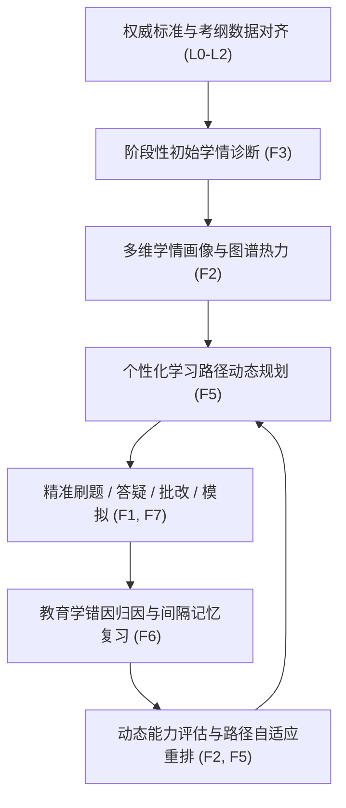
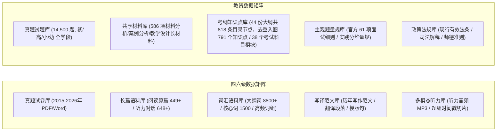
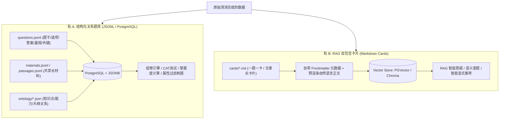
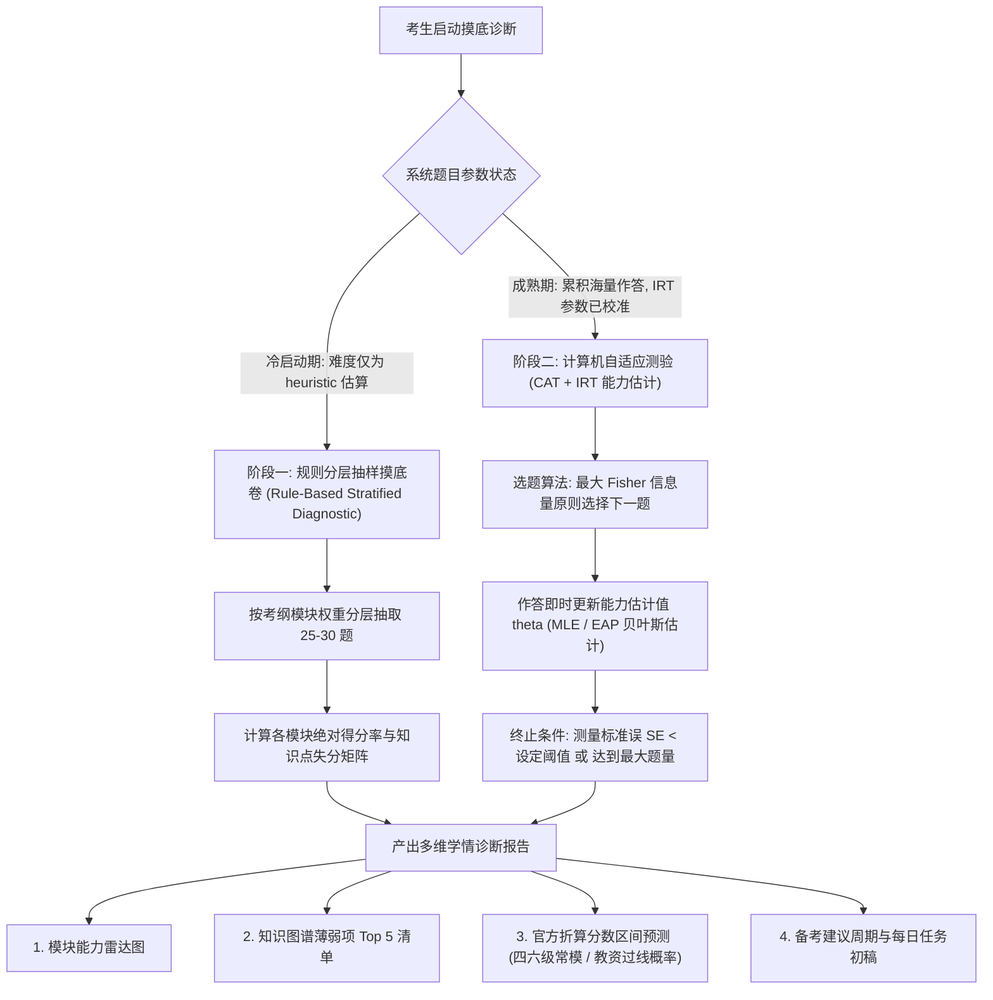
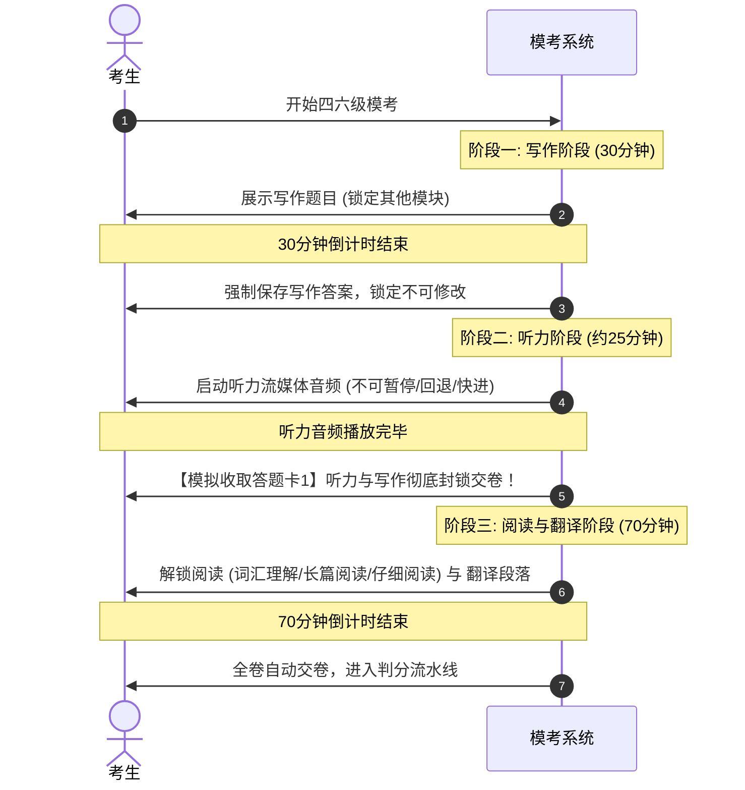
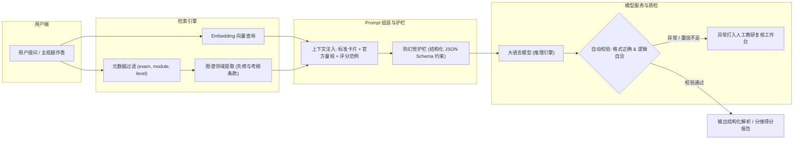

# 应试考证功能设计与技术支撑：以教资和四六级为例

## 1. 系统定位与核心场景

### 1.1 系统定位与目标用户
本系统定位为**面向大学英语四六级考试（CET-4/6）与中小学教师资格考试（NTCE）的权威、循证、自适应智能备考与学情诊断平台**（科研实验与智能教育基准系统）。系统以国家考试大纲、国家能力等级标准及法律法规为唯一锚点，构建全链路可追溯的知识图谱与结构化题库，提供从初始摸底、能力画像、动态排程、自适应刷题到全真模考的一站式智能备考闭环。

**目标用户画像：**
1. **高校在校生（四六级备考人群）**：需要精准突破词汇瓶颈、掌握长篇阅读同义替换定位法、克服听力瞬时信息抓取障碍，并获取四六级写作与翻译的句式升级与规范批改。
2. **师范生及社会考生（教资备考人群）**：面对教育学与心理学庞杂理论体系，需要清晰的考点前置依赖图谱；面对法规条文需要时效性核验；面对占分极高的主观题（材料分析、教学设计、综合素质作文）及线下结构化面试/试讲，需要可计算的评分量规与仿真演练。

### 1.2 考制属性与测验学差异矩阵
四六级与教资在教育测量学（Psychometrics）上属于完全不同类型的考试，系统设计必须严格区分其评分机制与教学策略：

| 维度 | 大学英语四六级（CET-4/6） | 中小学教师资格考试（NTCE） | 系统针对性设计 |
| --- | --- | --- | --- |
| **测验性质** | **常模参照测验 (Norm-Referenced Test)**，考查英语综合应用水平 | **标准参照测验 (Criterion-Referenced Test)**，考查教师职业准入资格 | 四六级侧重横向能力排位与常模分数映射；教资侧重考纲知识点达标率与过线判定 |
| **分制与换算** | 卷面分通过正态化常模样本换算为 **710 分制报道分**（均值 500，标准差 70） | 卷面满分 150 分，通过线性分段函数转换为 **120 分制报告分**（全国统一合格线 70 分） | 四六级提供基于常模区间的预测分数；教资提供过线概率与报告分 70 分差距诊断 |
| **题型主客结构** | 客观题为主（听力 35% + 阅读 35% = 70%）；主观题为写译（写作 15% + 翻译 15% = 30%） | 主观题为主（科一/科二主观题占 65%–70%，含单题 40 分的教学设计、50 分的作文） | 四六级强化听读客观题快速判定与同义词溯源；教资强化大题干材料共享与多维量规批改 |
| **多模态与面试** | 包含 25–30 分钟音频听力流，严格分段播放；口试单独设考 | 笔试通过后必须参加线下**面试**（5分钟结构化 + 10分钟试讲 + 5分钟答辩） | 四六级系统内置音频切片流媒体播放；教资系统内置面试试讲任务库与语音人机问答 |

---

## 2. 建设目标与核心设计原则

### 2.1 建设目标
面向大学英语四六级和教师资格考试，构建一个以权威数据、标准知识图谱、学情诊断、个性化路径、精准训练和能力评价为核心的智能学习系统，实现闭环运转：



### 2.2 核心设计原则
1. **标准优先（Evidence-Based Standards）**  
   所有知识点、试题、解析、评分量规和评价指标必须能够回溯至考试大纲、国家标准（如 CSE）、法律法规或历年真题出处。不采用无来源依据的编造数据。
2. **层层递进（Strict Hierarchy）**  
   严格执行从“官方标准 $\rightarrow$ 核心素养 $\rightarrow$ 能力维度 $\rightarrow$ 知识点 $\rightarrow$ 语篇/材料 $\rightarrow$ 试题 $\rightarrow$ 资源 $\rightarrow$ 学习行为”的完整映射链条，杜绝知识孤岛与粗放标签。
3. **一一对应（Explicit Binding）**  
   每道试题、每项学习资源均必须显式绑定所属考试、模块、具体知识点、能力维度及大纲条款 ID，不允许挂空或仅挂载模糊的根节点。
4. **诊断驱动（Diagnostic-Driven）**  
   先诊断、后推荐；先识别认知盲区、再安排变式强化，避免盲目刷题。
5. **人机协同与置信流转（Human-in-the-Loop）**  
   AI 可辅助初标知识点、生成解析初稿及实施主观题预批改，但必须标记生成来源；高风险内容由学科教研专家审核，状态由 `auto_parsed`/`llm_draft` 流转为 `expert_reviewed`。
6. **可解释、可追溯、可纠错（Explainable & Traceable）**  
   对考生展示推荐理由与解析出处；对教研人员展示题源切片与模型决策依据；提供前端用户纠错反馈通道，形成数据质检闭环。
7. **双轨分离消费（Dual-Track Consumption）**  
   数据持久层区分“结构化关系题库（支撑刷题引擎、规则筛选与量规计算）”与“Markdown 自包含卡片（支撑 RAG 向量检索与大模型问答）”，保证各技术子系统高内聚、低耦合。
8. **求真务实、严禁伪造校准（Authenticity First）**  
   在缺乏大样本真实作答数据时，难度必须如实标注为启发式估算（`heuristic`），严禁标注为已完成 `IRT` 真实校准；未核定答案进隔离队列，杜绝假数据通过门禁。

---

## 3. 标准化数据架构与数据库设计

### 3.1 规范依据与数据源

#### 国家权威规范依据
| 考试 | 规范依据 | 现行版本/法律效力 | 说明 |
| --- | --- | --- | --- |
| **四六级 CET** | 《全国大学英语四、六级考试大纲》 | 2016 修订版（现行大纲及各模块官网说明） | 题型结构、分值比例、常模转换基准、词汇表依据 |
| **英语能力量表** | 《中国英语能力等级量表》（CSE） | **GF 0018—2024**（2024-11-26 发布，2025-03-01 实施；替代历史 GF 0018—2018） | 收录 3,886 条官方微观能力描述语（GF 0018—2024 计 3,741 条 + GF 0018—2018 计 145 条），作为能力挂载标尺（原稿笔误 GB/T 41671 系化纤标准，已校正）。**当前状态：条目已入库但尚无题目或知识点完成到 CSE 描述语的逐条对齐，挂载率为 0，需教研逐条核定** |
| **教资 NTCE** | 教育部教育考试院《中小学教师资格考试大纲》 | 现行大纲（覆盖幼/小/中 35 科笔试大纲及 3 科面试大纲） | 模块、考试目标、题型示例及面试 61 项官方细则 |
| **基础教育课程标准** | 教育部《义务教育课程方案和课程标准》 | 2022 年版 | 影响中小学学科知识与教学设计主观题考查要求 |
| **学前教育核心法规** | 《中华人民共和国学前教育法》 | 2024-11-08 通过，**2025-06-01 施行** | 幼教保教法规模块重大核心考核依据 |
| **基础教育法律法规** | 《教育法》《教师法》《未成年人保护法》《预防未成年人犯罪法》 | 《未保法》2024 修正；《教师法》修订进程 | 科一《综合素质》法律法规模块必须紧扣现行最新修正条文 |

#### 数据分类与建设矩阵


---

### 3.2 完整八层数据层级（L0–L7）

系统彻底贯彻原则 2 的要求，定义端到端的八层数据模型：

```plain
L0 权威标准层 (standard / requirement)
   └ 官方考纲条款 (ntce.outline.311.r008) 与量表描述语 (cse.gf0018-2024.r001)
L1 考试与学段层 (exam & school_level)
   └ CET-4 / CET-6 / NTCE-幼 / NTCE-小 / NTCE-初中 / NTCE-高中
L2 模块与科目层 (module & subject)
   └ CET: 听力 / 阅读 / 写作 / 翻译
   └ NTCE: 综合素质 / 保教(教育教学)知识与能力 / 学科知识与教学能力(15+学科)
L3 素养与能力维度层 (competency & ability)
   └ 如 CET: 信息定位能力 / 推理判断能力；NTCE: 教育理念理解能力 / 教学设计能力
L4 细粒度知识点图谱层 (knowledge_node)
   └ 考纲树与先修依赖关系 DAG (含 prereq 边)，具有确定概念范畴
L5 共享材料与语篇层 (passage & material)
   └ 独立长文本实体：阅读长篇文章、听力对话全文、案例长材料、试讲教材片段
L6 试题与评测任务层 (question & task)
   └ 单一可评估题目：客观选择、填空、主观简答、材料小问、写作、翻译、面试试讲
L7 学习资源与时序行为层 (resource & learning_log)
   ├ 学习资源：词汇词条、高分范文、模板句、变式题、微课
   └ 学习行为：用户作答日志、错题记录、掌握度时序衰减状态 (mastery)
```

**落库现状（2026-10-09 重新导出）**：`graph/nodes.jsonl` 的 `layer` 字段只保留这一套 L0–L7 编号，教资导出层已删掉与之并存的 `hierarchy_level` 双轨字段，两库由 `tests/test_graph_direction_contract.py` 全量钉住。

| 层级 | 教资 NTCE 节点数 | 四六级 CET 节点数 | 备注 |
| --- | --- | --- | --- |
| L0 标准与条款 | 2,320（标准 60 + 条款 2,260） | 4,001（标准 6 + 条款 3,995） | catalog 67 份来源、6,255 条有效条款全量入图；142 条退休条目只留 `权威资料/retired_requirement_records.jsonl`，不入图也不计覆盖分母。条款一律 `verified=false`，等教研核定 |
| L1 考试 | 7 | 2 | 教资按学段×类别分列 |
| L2 模块与科目 | 38 | 8 | — |
| L3 素养与能力 | 51（素养 7 + 能力 44） | 30（素养 2 + 能力 28） | 能力不做隐式继承，只认显式边 |
| L4 知识点 | 791 | 48 | 四六级 48 个知识点无一孤立：30 个被题目 `assesses` 引用；余 18 个虽无题目落点，仍各自带大纲对齐（`aligned_to_requirement` 24 条）、层级（`contains`/`has_child` 44 条）、先修（`prerequisite_of` 30 条）、易混与迷思（6 条）、资源补充（`supplements_resource` 1,352 条）边，属**命题缺口**而不是空节点。叶子粒度仍偏粗，需继续下钻 |
| L5 共享材料 | 586 | 449 | — |
| L6 试题与量规 | 18,303（题 14,500 + 量规 3,803） | 5,634（题 5,632 + 量规 2） | 四六级的 2 份量规被 292 道写译题复用 |
| L7 学习资源 | 8（法规原文） | 15,487（词汇 14,478 + 范文/译文 292 + 模板句 69 + 未标类型 648） | 范文/译文与题目同号，入图时加 `res.` 前缀以免覆盖 L6 题目节点 |
| 合计 | **22,104** | **25,659** | 边 96,774 / 86,688 条 |

---

### 3.3 双轨数据消费机制（Dual-Track Architecture）

为了同时满足“刷题引擎的高性能过滤、关系运算”与“大模型 RAG 的语义向量召回”，系统在物理存储与消费上采用双轨设计：



* **轨 A（结构化数据）**：
  * **形态**：`questions.jsonl`、`materials.jsonl`、`passages.jsonl`。
  * **定位**：不走向量，作为系统权威事实源（Source of Truth）。每道题只存自身的题干、选项、答案、得分点和关联外键 ID，长材料仅通过 `material_id` / `passage_id` 引用，避免数据膨胀。
* **轨 B（RAG 卡片数据）**：
  * **形态**：`cards/{level}/{subject}/{session}/q{卷内题序两位}.md`（如 `q30.md`；题序取自试卷原卷题号 `paper_order`，非三位补零）。
  * **覆盖现状**：教资 14,500 道题已产出 12,881 张卡片，尚有 1,619 道（多为重复卷、无正文或材料分析长题）未出卡；四六级 5,632 道题对应 5,340 张卡片。缺卡清单见 `审查/待复核清单.md`。
  * **定位**：一题一卡、自包含。首行预渲染自然语言摘要（如 `【2023下半年·初中综合素质·材料分析·第30题】`），将关联的长材料全文合并随卡附带，头部携带完整的 YAML Frontmatter。向量召回后模型无需多次回表拼装上下文即可完整理解。

---

### 3.4 知识图谱拓扑与关系规范

图谱实体包含：`Standard`（标准）、`StandardRequirement`（标准条款）、`Exam`/`Module`（考试与模块）、`Literacy`/`Ability`（素养与能力）、`KnowledgeNode`（知识点）、`Material`（长材料）、`Question`（试题）、`Rubric`（评分量规）、`Resource`（学习资源）。

**核心边（Edge）类型与约束定义：**

> **落库方向约定**：`graph/edges.jsonl` 统一以"支撑方 → 被支撑方"为有向边方向，即 `src` 是提供者（Standard / StandardRequirement / Ability / KnowledgeNode / Module），`dst` 是接受者（KnowledgeNode / Question / Material / Rubric / Resource）。查询"这道题依赖哪些知识点"即沿 `dst = question_id` 反向取边；查询"这个知识点被哪些题考查"即沿 `src = node_id` 正向取边。两套库使用同一套边名与同一方向，由 `tests/test_graph_direction_contract.py` 对两库全量边逐条校验端点类型。
> **本轮修复**：教资导出层此前把 `assesses`、`supports_ability`、`aligned_to_requirement` 三类边写成了与四六级相反的方向（题目 → 知识点 / 能力 / 条款），同一份消费代码无法同时跑两库；现 `kb_tools/build_graph.py` 与 `数据集/四六级/scripts/build_graph.py` 同向，`审查/validate_kb.py`、`审查/知识库形式审查.py` 的读取端点也已随之校正。

1. `prerequisite_of`（先修关系，`KnowledgeNode` $\rightarrow$ `KnowledgeNode`）：
   * **数学约束**：严格构成**有向无环图（DAG）**。
   * **状态分类**：`verified`（经教研审核的真实概念依赖）与 `proposed_pending_review`（根据大纲顺序或模型建议生成的候选边）。未审核候选边不得直接用于强制前置阻断。
   * **落库约束**：`status = verified` 必须同时携带 `reviewed_by`（教研审核人，图谱边沿用此键；实体侧用 `review.checked_by`，见附录 A.1）；脚本自评的 `approved/verified` 一律被导出层降为 `proposed_pending_review`，原声明保留在 `declared_status` 留痕，并置 `active_for_learning_path = false`。当前两库**没有任何已核定先修边**（教资 31 条、四六级 56 条全部待核定，其中教资 13 条来自可版本化的策展源文件 `数据集/教资/graph/edges_curated.jsonl`），因此 F2 的前置阻断暂不启用。逐条清单（含依据原文）见 [`审查/待复核清单.md`](file:///d:/codeplus/knowledge_map/审查/待复核清单.md) 第 1 节。
2. `assesses`（考查关系，`KnowledgeNode` $\rightarrow$ `Question`）：
   * 一道题必须挂载 1 至 $N$ 个具体可评测知识点，不得挂载根节点。
3. `supports_ability`（能力支撑，`Ability` $\rightarrow$ `KnowledgeNode` / `Question`）：
   * 明确知识点对宏观素养与微观能力维度的支撑；能力**不做隐式继承**，只认显式边与题目上的 `ability_ids`。
4. `aligned_to_requirement`（考纲对齐，`StandardRequirement` $\rightarrow$ `KnowledgeNode` / `Question`）：
   * 建立到官方大纲条目 ID（如 `ntce.outline.*`、`cet.syllabus.*`）的精确对齐；自动对齐一律 `verified = false` 等待教研复核。
5. `refers_to_material`（材料关联，`Question` $\rightarrow$ `Material`/`Passage`，实现中曾用名 `refers_to_passage`）：
   * 双向引用，题目标注材料 ID，材料登记引用它的题号列表。
6. `has_rubric`（量规绑定，`Question` $\rightarrow$ `Rubric`）：
   * 只有主观题绑定量规，选择题按选项字母判分不绑任何量规（`Q_RUBRIC_ON_OBJECTIVE` 拒绝反向写法）。教资 3,803 个 `Rubric` 节点里有 3,736 条绑定边，均来自**题内练习框架**（`rubric.<question_id>`，无分值权重，只能出反馈不能出分）；余下 67 个节点无人绑定——6 个是 附录 A.6 的加权量规实体（`review.status = needs_fix`，权重待教研签署），61 个是官方 61 项面试细则的逐条参照节点（`official: true`，`review_status = question_task_mapping_pending_review`）。四六级 2 份官方档次量规被 292 道写译题复用。判分功能在权重签署前只能走"框架反馈 + 人工复核"，不能声称自动出分。

**扩展边（实现层，同样遵循"支撑方 → 被支撑方"，两库同名同向）**：除上述六条核心语义边外，八层结构还需要层级包含、资源与易错点三类边，否则 L0–L2 与 L7 在图里会连不通。

| 边名 | 含义与端点 | 教资 | 四六级 |
| --- | --- | --- | --- |
| `specifies` | `Standard` → `StandardRequirement`，标准指明条款 | 2,260 | 3,995 |
| `contains` | `Exam`/`Module` → 下层实体（模块、题目、知识点、材料） | 14,709 | 5,650 |
| `has_child` | 知识树父子边（`Module`/`KnowledgeNode` → `KnowledgeNode`） | 620 | 38 |
| `comprises` | `Literacy` → `Ability`，素养由哪些能力构成 | 44 | 28 |
| `targets` | `Exam`/`Module` → `Literacy`，本级培育的目标素养 | 7 | 2 |
| `basis` | `Standard` → `Module`，模块的官方依据（一律 `verified=false` 待核定） | 36 | 0（四六级未生成依据边，属待补项） |
| `supports_resource` | `Ability` → `Resource`，能力对应的学习资源 | 13 | 18,557 |
| `supplements_resource` | `KnowledgeNode` → `Resource`，知识点配套的词汇/法规资源 | 8 | 18,703 |
| `confused_with` | `KnowledgeNode` ↔ `KnowledgeNode` 易混淆对（策展源文件，双向建边） | 7 | 10 |
| `misconception_lead_to` | `KnowledgeNode` → 由该迷思概念导致的错误 | 3 | 4 |

上述 16 个边名之外不得再出现新边名；出现即视为契约违规，`tests/test_graph_direction_contract.py` 会直接失败并要求先补充本节文档。

---

## 4. 业务功能深度设计

### 4.1 F1 智能刷题
* **训练模式**：提供章节练习、知识点突破、题型专练、历年套卷、弱项攻坚、错题回炉、限时冲刺 7 种模式。
* **题目标签多维体系**：
  每道试题必须包含 9 类规范标签：
  `考试标签`（CET-4/6, NTCE-学段-学科）、`模块标签`（听力/阅读/综合素质/保教等）、`题型标签`（单选/仔细阅读/材料分析/教学设计等）、`知识点标签`（具体叶子节点 ID）、`能力标签`（信息定位/逻辑推理等）、`难度标签`（0–1 浮点数，附带 `heuristic` 或 `calibrated` 状态）、`来源标签`（年份/套次/卷型/回忆版标识）、`审核标签`（`auto_parsed`/`checked`/`expert_reviewed`）、`版权标签`（`research_non_commercial`）。
* **AI 题目解析规范（星火三段链条 + 评分量规）**：
  解析必须按固定结构输出，禁止自由散漫生成：
  1. **`key_info` 题眼与考点定位**：提取题干关键限定词、定位词，明确考查知识点与能力点；
  2. **`option_compare` 选项对比/得分点剖析**：客观点逐项分析干扰项特征（偷换概念、无中生有、过于绝对等）；主观题给出标答得分要点；
  3. **`trace_back` 原文/法条溯源**：阅读/听力给出原文定位句及同义替换词对；教资给出具体教育理论出处或现行法条项；
  4. **`analysis.method` + `analysis.status` 解析来源与审核戳**：库里**没有** `generation_source` 这个键，来源与审核由三组字段承载——`analysis.method` 标产出方式（教资：`rule_kb_draft` 7,698、`llm` 2,991、`qwen-plus_structured_v1` 2,044、`harness_llm` 1,717、`qwen-plus_deduced_candidate_v1` 20、`ai` 16、`source_grounded_editorial_draft` 8；四六级：`published_explanation_text_extraction` 652、`expert_written` 292），`analysis.status` 标审核态（`rule_draft_pending_expert`、`llm_draft_pending_expert`、`source_extracted_pending_expert_review` 等，全部是"待专家"），`analysis.expert_verified` 标是否已核。大模型产出的 4,724 题在 `analysis.generation` 里记 `requested_model`（deepseek-flash 2,991，其余 1,733 为该键为 null 的 harness 批次）、`prompt_sha256`、`created_at`、`thinking` 开关与响应状态；四六级抽取型记 `analysis.source.locator`（指回解析 PDF 的题号与页）。取值枚举由 `schemas/question.json` 的 `analysis.method` 约束；四六级另有 4,688 题尚无 `analysis.method`（解析正文未抽取到，属缺口而非默认官方口径）。
* **数据异常与争议题隔离机制**：
  针对教资历史试题中的版本答案冲突题（当前库有 1,040 道 `source_conflict`），系统在前台将判分降级为**“开放讨论题”**或**“争议解析提示”**，不扣减用户能力分，并在解析中呈现多方争议观点与法条最新沿革。

### 4.2 F2 知识图谱与动态学情画像
* **静态资产与动态叠加机制（Runtime Overlay）**：
  * **底层图谱（静态）**：大纲本体树、能力节点与依赖 DAG 属于系统全局版本化静态资产，不随用户作答而变动结构。
  * **掌握度视图（动态 Overlay）**：每个用户的学情数据表现为覆盖在静态图上的属性层。节点以颜色热力呈现掌握状态（红色：薄弱/未掌握 $<0.4$；黄色：待巩固 $0.4–0.75$；绿色：已掌握 $\ge 0.75$；灰色：未激活）。
* **掌握度计算与衰减模型**：
  节点掌握度 $M_{u,k} \in [0, 1]$ 综合由作答正确率、题目难度权重、作答置信度及艾宾浩斯时间衰减因子动态计算：
  $$M_{u,k}(t) = \left( \alpha \cdot \bar{P}_{correct} + (1 - \alpha) \cdot \bar{D}_{weight} \right) \cdot e^{-\lambda (t - t_{last})}$$
  提供交互式入口，支持考生点击图谱任意节点直接启动针对性微课或专项突破。

---

### 4.3 F3 渐进式学情诊断（含冷启动降级策略）

针对测验学理论与项目数据现状，系统采取**双阶段渐进式诊断机制**，彻底解决“无大样本作答数据无法运行 IRT/CAT”的工程矛盾：



#### 分数区间预测算法规则
* **四六级预测**：严禁采用绝对卷面分线性折算。系统根据阅读、听力、写译的抽样得分率，映射至官方正态常模区间表，输出 `预测得分区间 [Score_min, Score_max]`（例如 `[485, 520]`），附带免责提示。
* **教资预测**：基于卷面分加权估算，结合各省历年笔试及格率换算公式，输出 `预测通过概率区间` 与 `对应报告分预测区间`（例如 `预计报告分 68-74 分，通过概率 58%`）。

---

### 4.4 F4 个性化推荐与 F5 动态学习路径规划
* **学习路径生成算法（DAG 拓扑排序 + 倒排规划）**：
  1. **输入参数**：目标考试、目标分数（如 CET-4 500分 / 教资及格）、备考剩余天数 $D$、每日可用时长 $T$。
  2. **剪枝与拓扑排序**：
     * 过滤已掌握节点（$M_{u,k} \ge 0.75$）；
     * 提取薄弱与未学习节点，沿 `prerequisite_of` DAG 构建拓扑序列；
     * 若剩余总时长不足，按照**考纲考频权重（Frequency Weight）**进行启发式贪心剪枝，优先保障高频核心考点。
  3. **日历任务排程**：生成细化至每日的“学新知 + 刷变式 + 复习错题”任务清单。
* **动态重规划触发器**：
  每次全真模考、专项练习完成后，若某关键节点失分导致掌握度大幅下降，触发局部重排；若做题速度超前或严重滞后计划，自适应调整后续每日训练量。

---

### 4.5 F6 错题归因与间隔记忆复习
* **教育学错因归因分类树**：
  当用户做错题目时，系统结合答题耗时、修改轨迹与追问互动，归入五维归因矩阵：
  1. `概念盲区`（知识点未掌握，未建立认知）；
  2. `混淆误判`（先修知识辨析不清，落入典型干扰项陷阱）；
  3. `审题疏漏`（忽略题干否定词、限定词，作答时间过短）；
  4. `策略不当`（时间分配不足，后半程随机猜选）；
  5. `规范缺失`（主观题要点遗漏、法条引用不准、答题结构失衡）。
* **间隔复习机制（FSRS 算法映射规范）**：
  系统接入现代自由间隔重复调度算法（Free Spaced Repetition Scheduler, FSRS），将做题行为映射为标准评分：
  | 用户作答行为 | FSRS 评分等级 | 调度策略 |
  | --- | --- | --- |
  | 首次作答错误 / 重复作答仍错 | **Again (1)** | 立即加入当日复习队列，提供原题解析与变式微课 |
  | 作答正确但耗时过长 / 修改后才对 | **Hard (2)** | 缩短复习间隔（通常 1–2 天内回炉） |
  | 正常作答正确 | **Good (3)** | 按照正常记忆遗忘曲线调度复习 |
  | 熟练秒杀正确 / 连续 2 次间隔复习正确 | **Easy (4)** | 大幅延长间隔（1–2 周后巩固） |

---

### 4.6 F7 全真模拟考试

#### (1) 四六级全真模考考务仿真规则
系统必须严格还原四六级全国考务的时序约束，禁止自由跨模块答题：


#### (2) 教资笔试全真模考
* 按照幼/小/初/高学段及对应科目配置全卷；客观题即时判分。
* 主观题支持手写拍照 OCR 识别与富文本长输入，设置本地 LocalStorage 实时草稿缓存防丢失机制。
* 自动按照官方五维标准（要点覆盖、理论运用、逻辑结构、语言表达、答题规范）生成主观题评测分析。

#### (3) 教资面试仿真与务实降级工程方案
针对“AI 评测试讲板书与互动”在纯纯软件端落地难的问题，采取三层务实架构：
1. **结构化问答训练（可完全自动化）**：随机抽取 2 道经典问答题，系统倒计时，通过麦克风录入考生语音（ASR 转写为文本），LLM 按照“政治导向、综合分析能力、应变能力、语言表达”即时评分与反馈。
2. **备课与教学设计辅助（可完全自动化）**：给出教材片段，限定 20 分钟内完成简案设计，系统比对教学三维目标（核心素养目标）、教学重难点、活动步骤的完备性。
3. **虚拟试讲评估（渐进式降级落地）**：
   * **MVP 实用版**：考生进行 10 分钟无生试讲音频录制。系统提取音频流，分析**语速（词/分钟）、停顿分布、口头禅高频词、语气抑扬顿挫**，结合 ASR 转写文本评测教学环节完整度（导入、新授、巩固、小结、作业）；
   * **进阶版（结合摄像头）**：利用轻量视觉模型检测考生面部朝向、教态仪态站姿及手势幅度，提供演练改进报告；明确声明该反馈为备考辅助，不替代正式考试评分。

---

## 5. 技术支撑与系统架构

### 5.1 存储架构与技术选型

| 子系统 | 选型组件 | 选型依据与职责 |
| --- | --- | --- |
| **主关系与题库** | **PostgreSQL (含 JSONB)** | 存储题目结构、用户信息、作答流水、大纲实体。选项与多维标签存储于 JSONB 字段，兼具关系一致性与文档灵活性。 |
| **RAG 向量存储** | **pgvector 扩展 / Chroma** | 原型与中等规模直接采用 PostgreSQL 的 `pgvector`，避免跨库数据同步；生产大规模可解耦至独立向量库。 |
| **全文检索** | **PostgreSQL 全文检索 / Elasticsearch** | 题干与知识点多条件精确过滤匹配。 |
| **图拓扑引擎** | **NetworkX (单机内存) $\rightarrow$ Neo4j (生产演进)** | 当前教资 791 个知识点/22,104 节点/96,774 边，四六级 48 个知识点/25,659 节点/86,688 边（四六级仅 30 个知识点被题目实际引用，粒度仍偏粗，需继续下钻），内存图或关系表递归（CTE）性能极佳且零运维开销；后期复杂拓扑平滑升级至 Neo4j。 |
| **缓存与排队** | **Redis + Celery / BullMQ** | 承载模考倒计时、分布式答题锁、LLM 异步批量解析任务队列。 |
| **对象存储** | **MinIO / 云对象存储 S3** | 存储真题原件 PDF、听力 MP3 音频切片、考生手写拍照作答图片。 |

---

### 5.2 RAG 智能问答与 LLM 测评工程



* **主观题量规注入（Rubric Prompting）**：主观题打分严格绑定官方或经教研审核的结构化量规（Rubric），强制输出分维度得分、扣分点说明及针对性修改建议。
* **结构化输出约束**：采用 JSON Schema 强制模型返回结构化解析，防止格式崩溃。

---

### 5.3 算法演进与冷启动生命周期路线图

```plain
[阶段一: 系统上线与冷启动期 (0 - 500 用户)]
├ 难度处理: 采用规则启发式估算 (heuristic)，界面明示 "教研初估"
├ 摸底诊断: 采用基于考纲权重的分层抽样摸底卷
├ 路径推荐: 基于 DAG 拓扑排序的最短先修路径算法
└ 知识追踪: 基于作答计数的滑动窗口衰减掌握度

[阶段二: 数据积累与校准期 (500 - 5,000 用户)]
├ 难度处理: 累积作答样本，运行边缘极大似然估计 (MMLE) 校准 IRT 两参数 (2PL) 模型
├ 摸底诊断: 引入初步计算机自适应测验 (CAT)
└ 知识追踪: 引入贝叶斯知识追踪模型 (BKT) 估计掌握概率

[阶段三: 成熟演进期 (5,000+ 用户)]
├ 诊断与推荐: 深度知识追踪 (DKT) + 强化学习自适应排程
└ 试讲与写作: 结合多模态模型完成教态语音综合评测
```

---

### 5.4 人机协同审核与纠错闭环工作流

1. **题目状态机流转**（`review.status`，附录 A.1 已把这 6 个状态写成 Schema 封闭枚举，此前的中文别名「已清洗/待复核/低置信/待专家审核」已从枚举删除）：
   * `auto_parsed`（原始数据清洗自动生成） $\rightarrow$ 
   * `llm_enhanced`（经由 LLM 补全三段解析/量规） $\rightarrow$ 
   * `checked`（教研人员抽检核实） $\rightarrow$ 
   * `expert_reviewed`（学科专家终审通过并上架）；异常分支为 `needs_fix`（已发现内容缺陷并隔离，不参与诊断）与 `quarantined`（来源冲突冻结）。
   * **状态不得自评**：`checked`/`expert_reviewed` 必须同时携带 `review.checked_by` 与 `review.checked_at`（或 `review.evidence`）。缺少署名的自评声明不构成审核结论：实体侧由 `kb_tools/ntce_contract.py`、`数据集/四六级/scripts/migrate_v2_schema.py` 降回 `needs_fix`；图谱边侧由 `kb_tools/build_graph.py` 降为 `proposed_pending_review`，原声明保留在 `declared_status` 留痕并置 `active_for_learning_path = false`；`审查/validate_kb.py` 把越界取值与无署名核准记为结构性错误。
   * **审核人键统一**：实体一律用 `review.checked_by` / `review.checked_at`（四六级历史上的 `reviewed_by`/`reviewed_at` 已由迁移脚本合并进规范键，空值补齐）；只有图谱边沿用 `reviewed_by`。
2. **三层状态分离**（两库同一张词表，由 `审查/状态词表检查.py` 逐条扫描全库 JSONL/JSON；2026-10-09 教资 15,182 条、四六级 31,991 条记录，违规各 0）：
   * `review.status`：内容审核链路位置，如上 6 态；
   * `content.answer_status`：答案可用性五态 `verified|letter_only|reference_only|missing|source_conflict`，Schema 已列为必填；
   * `extra.answer_provenance`：细粒度抽取形状**原样**保留（`letter`、`reference`、`brief`、`derived_reference`、`original_reference_draft_pending_expert`、`official_source_available_pending_expert_review`、`missing_source` 等），仅供教研定位证据，不参与诊断；旧键 `extra.answer_status` 再出现即记结构性错误。
   * 复核严重度不再挤进状态字段：`review.review_priority` $\in$ `low_confidence|flagged_general|none|unspecified`（教资原「低置信/待复核」分级迁到此处）；材料抽取进度另存 `review.extraction_status`，与 `review.status` 分离。
3. **当前底数（2026-10-09 重新校验，逐项可在 `审查/待复核清单.md` 第 0 节复核）**：
   * 教资 14,500 题：答案 `letter_only` 9,972 / `reference_only` 3,339 / `source_conflict` 1,040 / `missing` 149，`verified` **0**（有非空答案字段 9,991 题）；复核 `needs_fix` 13,460 + `quarantined` 1,040，`auto_parsed`/`checked`/`expert_reviewed` **0**；复核优先级 `low_confidence` 4,077、`flagged_general` 10,423。
   * 四六级 5,632 题：答案 `missing` 3,954 / `letter_only` 1,285 / `reference_only` 292 / `source_conflict` 101，`verified` **0**（有非空答案字段 1,577 题）；复核 `auto_parsed` 5,354 / `needs_fix` 177 / `quarantined` 101；带音频指针 1,969 题。
   * 两库**具名审核人 0 人、经真实作答数据校准的难度 0 条**（难度全部为启发式估计，`difficulty_meta.method` 以 `heuristic_*` 标记）；先修边 教资 31 条、四六级 56 条全部待核定；catalog 的 6,255 条有效条款已全部进 L0 图层，但只有 548 条被 `aligned_to_requirement` 引用，**5,707 条尚未被任何知识点或题目引用**（另有 142 条退休条款只作抽取留痕，不计入分母）。未引用是命题缺口，不是挂载失败——条款在图里才能被教研逐项判定。
   * 结论：图谱与 Schema 已可用，但**教研核定队列尚未开始消费**，F1/F3/F5 的诊断结论目前不可对外声称。待办队列（先修、条款、答案与来源缺口、优先级分组）与签署流程见 [`审查/待复核清单.md`](file:///d:/codeplus/knowledge_map/审查/待复核清单.md)。
4. **用户前端纠错闭环**：
   用户在题目界面点击"反馈纠错"（如选项错误、答案存疑、解析不清），工单写入 `review_pending` 表；教研人员在审核控制台进行判定；若确认修复，题目版本递增，重新触发关联用户的掌握度更新，并对反馈用户发送闭环通知。

---

## 6. 数据治理、合规与验收规范

### 6.1 版权清权与合理使用边界
根据 [`教资KB版权清权报告.md`](file:///d:/codeplus/knowledge_map/教资KB版权清权报告.md) 的结论，本项目定位为**科研与教育实验用途，严格非商业化运作**：
1. **法律依据**：《中华人民共和国著作权法》第二十四条第一款第（六）项明确：为学校课堂教学或者科学研究，翻译、改编、汇编、播放或者少量复制已经发表的作品，可以不经著作权人许可、不向其支付报酬，但不得出版发行。
2. **三大守则**：
   * **绝不出版发行**：不印制成册、不上架售卖、不设商业付费墙；
   * **严格注明出处**：题目必须保留 `source.origin_file` 及规范来源属性；
   * **不得篡改原题**：对版本矛盾题目采用 `source_conflict` 隔离，绝不凭空篡改。
3. **来源性质细分四级标注**：
   * `official_exam`（官方真题原件，来源清晰）；
   * `exam_recall`（考生回忆版，标明汇编整理，防范转录误差）；
   * `compiled_selection`（真题精选，注明第三方二次汇编）；
   * `provincial_exam`（地方省考历史卷，单独命名空间隔离，不混入国考统计）。

---

### 6.2 质量验收门禁规则（对齐 `审查/validate_kb.py`、`审查/状态词表检查.py` 与 `tests/` 契约测试）

所有数据进入知识库发布阶段前，必须 100% 通过自动化门禁验收，杜绝以下缺陷：

| 门禁规则代码 | 规则含义与阻止行为 |
| --- | --- |
| `Q_KNOWLEDGE_TOO_BROAD` | 严禁仅挂载模块根节点（如 `cet4.read`）；必须挂载具体叶子知识点。 |
| `Q_ABILITY_MISSING` | 题目或资源未绑定任何能力维度（`ability_ids` 为空）报错。 |
| `Q_REQUIREMENT_DANGLING` | 题目的考纲条款 ID 在标准库中无法解析为有效条目。 |
| `Q_ANSWER_MISSING` | 需要判分的客观题答案为空，或仅为占位符。 |
| `Q_ANSWER_INVALID` | 答案字母不在该题实际 options 的键列表中（如单选选项为 ABCD，答案为 J）。 |
| `Q_ANSWER_SOURCE_CONFLICT` | 来源答案互相矛盾却仍给出可用答案；矛盾题必须 `source_conflict` + `answer = null`。 |
| `Q_ANSWER_STATE_INVALID` | `content.answer_status` 取值不在五态枚举内（含缺失该必填字段）。 |
| `Q_QUARANTINE_STATE_MISSING` | `answer_status = source_conflict` 却停留在 `needs_fix` 等瑕疵态；隔离题必须记 `quarantined`，否则会被消费层当作可判分题目。 |
| `Q_REVIEW_STATE_INVALID` | `review.status` 取值不在六态枚举内（中文别名、`source_parsed_pending_review` 等抽取态串写入即报错）。 |
| `Q_ANSWER_PROVENANCE_KEY_STALE` | 仍在用旧键 `extra.answer_status` 承载可用性；必须迁到 `content.answer_status` + `extra.answer_provenance`。 |
| `Q_REVIEW_EVIDENCE_MISSING` | 标为 `checked`/`expert_reviewed` 却缺少 `review.checked_by` 与审核时间/证据。 |
| `Q_DIFFICULTY_INVALID` | 难度不在 0–1 数值范围，或用布尔值冒充实测难度。 |
| `Q_DIFFICULTY_UNCALIBRATED` | 填报了浮点难度但缺乏真实作答校准依据（方法未标记 `heuristic` 或 `calibrated`）。 |
| `Q_RUBRIC_MISSING` | 主观题（教学设计、材料分析、写译）缺少多维评分量规。 |
| `Q_RUBRIC_ON_OBJECTIVE` | 单选/多选等选择题携带主观题评分框架或量规 ID（结构性错误）。选择题按选项字母判分，这类框架没有 `rubric_id` 时既不入图也不可判分，只在卡片正文可见，属影子量规。 |
| `Q_RUBRIC_DUAL_TRUTH` | 同一维度同时带 `name`/`levels`/`max_level` 与 `dimension_name`/`weight_score`/`criteria_levels`（结构性错误）。题内练习框架与 附录 A.6 加权量规两套字段混写时，消费端取哪一份就会得到哪种分数。 |
| `Q_RUBRIC_EXPERT_CLAIM` | 量规（题内框架或 `rubrics/*.json` 实体）标为 `expert_verified: true` 却没有具名审核人（结构性错误）。自动化不得声称专家已核，量规实体独立过一遍，不依赖题目引用路径。 |
| `Q_PASSAGE_UNLINKED` | 阅读理解或材料分析题未关联有效的共享长语料或材料 ID。 |
| `Q_COPYRIGHT_UNRESOLVED` | 版权三要素（`authorization_status`/`use_scope`/`source_nature`）缺失或留空。 |
| `Q_COPYRIGHT_CLAIM_UNSUPPORTED` | 声称 `authorized` 却没有授权证据；未获授权只能填 `unknown`。 |
| `Q_COPYRIGHT_SCOPE_OUT_OF_BOUNDS` | `use_scope` 越出 `research_non_commercial`（如擅自写 `commercial`）。 |
| `GRAPH_PREREQUISITE_CYCLE` | 知识图谱先修依赖关系存在有向环，破坏学习路径拓扑排序。 |
| `GRAPH_PREREQUISITE_PENDING_REVIEW` | 先修边仍为候选或未具名复核，不得进入正式学习路径。 |
| `GRAPH_PREREQUISITE_EVIDENCE_MISSING` | 先修边标为已核定却缺 `reviewed_by`（结构性错误）。 |
| `GRAPH_ENDPOINT_DANGLING` | 边的任一端点不在 `graph/nodes.jsonl` 中。 |

三道门禁脚本各自的职责：`审查/validate_kb.py` 查实体级与引用级缺陷（当前两库结构性错误 **0**，剩余 130,762 条为 `gap` 级教研待办，不构成结构错误）；`审查/状态词表检查.py` 逐条扫描两库所有 JSONL/JSON 的状态字段是否越界、必填是否缺失、provenance 是否被用作诊断依据；`tests/test_graph_direction_contract.py` 逐条校验两库每一条边的边名与端点类型（§3.4），检查 `layer` 只用 L0–L7 一套编号，并核对 **catalog 的全部有效条款都出现在 L0 图层、退休条款不出图**（此前教资按 `standard_id` 前缀硬筛、四六级只取"被题目引用到的条款"，两库合计静默丢了 4,967 条条款：四六级 3,963 条、教资侧的法规与教师标准 1,004 条）。另有一条跨轨不变式：`tests/test_status_vocabulary.py` 逐张比对卡片头部与题记录的状态镜像。量规有两条互不越界的轨道：`tests/test_rubric_contract.py` 校验选择题一律不带量规、`rubrics/*.json` 实体的权重之和等于满分且档位上界不越出维度权重、题内框架一律不带 `weight_score`/`criteria_levels`、`expert_verified` 必须有具名审核人；一次性迁移由 `kb_tools/ntce_rubric_contract.py` 完成（剥离 152 份选择题影子量规、删除 25 个维度的双套字段、降回 6 处无署名的 `expert_verified`），剥离规则与 `kb_tools/ntce_repair.py` 的 `drop_choice_framework()` 共用同一实现，所以修复脚本再跑也不会复现。回归套件：`python -m pytest tests -q` → 233 passed, 23 subtests passed。

---

## 附录 A：核心实体字段字典与 JSON Schema 定义

### A.1 试题实体规范（`question.json`）

> **单一权威 Schema 目录**：`数据集/教资/schemas/`（`question` / `material` / `knowledge_node` / `ability_node` / `requirement` / `rubric` / `practice_framework` / `user_mastery` / `card_frontmatter` 共 9 份）。四六级**不设副本**，由 `tests/test_cet_eight_layer_contract.py` 与 `tests/test_status_vocabulary.py` 直接加载同一目录做 Draft 2020-12 全量校验（20,132 道题，教资 14,500 + 四六级 5,632），避免两库 Schema 各自漂移。`question.json` 的 `$id` 为 `urn:knowledge-map:ntce-question:3.0`，`description` 已注明两库共用。

```json
{
  "$schema": "https://json-schema.org/draft/2020-12/schema",
  "$id": "urn:knowledge-map:ntce-question:3.0",
  "title": "ExamQuestion",
  "type": "object",
  "required": [
    "question_id", "exam", "school_level", "module", "subject",
    "question_type", "content", "knowledge_node_ids", "ability_ids",
    "exam_requirement_ids", "source", "review"
  ],
  "properties": {
    "question_id": {
      "type": "string",
      "description": "全局唯一ID，如 cet4-2024-06-p1-reading-12 或 ntce.junior.zonghe.2016b.q005"
    },
    "exam": {
      "type": "string",
      "enum": ["CET-4", "CET-6", "NTCE", "省考"]
    },
    "school_level": {
      "type": ["string", "null"],
      "enum": ["youer", "xiaoxue", "chuzhong", "gaozhong", "zhongxue", "zhongxiaoxue", null],
      "description": "教资专属学段标识，四六级为 null；zhongxue/zhongxiaoxue 为中学复合学段"
    },
    "module": {
      "type": "string",
      "description": "大模块名，如 阅读理解 / 听力理解 / 综合素质 / 教育教学知识与能力 / 学科知识与教学能力"
    },
    "subject": {
      "type": "string",
      "description": "规范化学科代码，如 english / zonghe / jiaoxue / baojiao / yuwen / dili"
    },
    "section": {
      "type": ["string", "null"],
      "description": "原卷分卷或大题节名称，如 单项选择题 / 材料分析题 / 教学设计题"
    },
    "question_type": {
      "type": "string",
      "description": "归一题型：单选 / 多选 / 选词填空 / 长篇阅读 / 仔细阅读 / 短篇新闻 / 长对话 / 听力篇章 / 讲座讲话 / 短文写作 / 段落翻译 / 简答 / 辨析 / 材料分析 / 教学设计 / 活动设计 / 论述 / 结构化问答 / 试讲"
    },
    "material_id": {
      "type": ["string", "null"],
      "description": "长材料或语篇指针，短题为 null"
    },
    "score": {
      "type": ["number", "null"],
      "description": "卷面标准分值"
    },
    "content": {
      "type": "object",
      "required": ["stem", "options", "answer", "answer_status"],
      "properties": {
        "stem": { "type": ["string", "null"], "description": "题干文本；听力口述题目尚未恢复时为 null" },
        "options": {
          "type": ["object", "array"],
          "description": "选项字典 {'A': '...', 'B': '...'} 或数组 [{'key':'A','text':'...'}]；空题为空数组/空对象"
        },
        "answer": {
          "type": ["string", "null"],
          "description": "标准答案字母或文本要点；争议题（source_conflict）与无答案为 null"
        },
        "answer_status": {
          "type": "string",
          "enum": ["verified", "letter_only", "reference_only", "missing", "source_conflict"],
          "description": "答案可用性五态（必填）；抽取形状另存 extra.answer_provenance，二者不得混写"
        }
      }
    },
    "analysis": {
      "type": ["object", "null"],
      "properties": {
        "key_info": { "type": ["string", "null"], "description": "题干题眼与关键信息定位" },
        "option_compare": { "type": ["string", "null"], "description": "逐项深度对比与干扰项归因 / 主观题得分点" },
        "trace_back": { "type": ["string", "null"], "description": "原文定位句或法条理论依据" },
        "explanation": { "type": ["string", "null"], "description": "综合解析正文" },
        "method": {
          "type": ["string", "null"],
          "enum": ["official", "expert_written", "llm_generated", "editorial_draft", "rule_kb_draft",
                   "harness_llm", "qwen-plus_structured_v1", "qwen-plus_deduced_candidate_v1",
                   "source_grounded_editorial_draft", "published_explanation_text_extraction", "content-rule-v2", null],
          "description": "解析产出来源；大模型生成与教研精编必须可区分"
        },
        "expert_verified": { "type": "boolean", "description": "解析是否经学科专家核验；无署名一律 false" }
      }
    },
    "knowledge_node_ids": {
      "type": "array",
      "items": { "type": "string" },
      "description": "挂载的具体知识点列表；Schema 允许空数组，但空挂载由 validate_kb.py 记 Q_KNOWLEDGE_MISSING 待补项"
    },
    "ability_ids": {
      "type": "array",
      "items": { "type": "string" },
      "description": "挂载的能力维度列表（能力不做隐式继承）"
    },
    "exam_requirement_ids": {
      "type": "array",
      "items": { "type": "string" },
      "description": "对齐的官方考纲或量表条款ID"
    },
    "rubric_id": {
      "type": ["string", "null"],
      "description": "主观题绑定的量规ID"
    },
    "rubric": {
      "type": ["object", "null"],
      "description": "题内练习评价框架（`practice_framework.json` 约束，无分值权重，只出反馈）；与顶层 rubric_id 同值，导出层据此建 L6 量规节点与 has_rubric 边。选择题必须两者皆空，加权量规请另建 A.6 实体"
    },
    "difficulty": {
      "type": ["number", "null"],
      "minimum": 0.0,
      "maximum": 1.0,
      "description": "难度值 [0, 1]，数值越大概率越难"
    },
    "difficulty_meta": {
      "type": ["object", "null"],
      "properties": {
        "method": {
          "type": ["string", "null"],
          "enum": ["heuristic", "heuristic_objective_v1", "heuristic_subjective_v1", "heuristic_linguistic_v1", "irt_calibrated", null],
          "description": "难度估计方法；无真实作答数据前一律 heuristic_*，不得标 irt_calibrated"
        },
        "calibration_status": { "type": ["string", "null"], "description": "校准状态，如 uncalibrated_heuristic / pending_response_data" },
        "sample_size": { "type": "integer" },
        "features": { "type": "object", "description": "启发式特征（选项数、材料长度、题型等）" },
        "description": { "type": "string" }
      }
    },
    "source": {
      "type": "object",
      "required": ["origin_file", "copyright"],
      "properties": {
        "type": { "type": "string", "enum": ["真题", "样卷", "模拟题", "省考"] },
        "year": { "type": "string" },
        "session": { "type": ["string", "null"], "description": "考次，如 2015上半年 / 2024-06" },
        "paper": { "type": ["string", "null"] },
        "origin_file": { "type": "string", "description": "原始文件相对路径（版权守则「严格注明出处」的落点）" },
        "verified": { "type": "boolean" },
        "files": { "type": "array" },
        "copyright": {
          "type": "object",
          "required": ["authorization_status"],
          "properties": {
            "authorization_status": { "type": "string", "enum": ["authorized", "public_domain", "unknown"], "description": "无授权证据一律 unknown；写 authorized 必须由 validate_kb.py 检查证据" },
            "use_scope": { "type": "string", "default": "research_non_commercial", "description": "越出科研非商业范围记 Q_COPYRIGHT_SCOPE_OUT_OF_BOUNDS" },
            "source_nature": { "type": "string", "enum": ["official_exam", "exam_recall", "compiled_selection", "provincial_exam"] },
            "holder": { "type": ["string", "null"], "description": "著作权人；未考证为 null，不留空键" },
            "expires_at": { "type": ["string", "null"] },
            "attribution_required": { "type": "boolean" },
            "nature_note": { "type": "string" },
            "nature_evidence": { "type": ["string", "array", "null"], "description": "判定 source_nature 的原文依据" },
            "evidence": { "type": ["array", "object", "null"] },
            "review_status": { "type": ["string", "null"], "description": "清权复核状态；未完成一律 pending" }
          }
        }
      }
    },
    "review": {

      "type": "object",
      "required": ["status"],
      "properties": {
        "status": {
          "type": "string",
          "enum": ["auto_parsed", "llm_enhanced", "checked", "expert_reviewed", "needs_fix", "quarantined"],
          "description": "封闭枚举；中文别名与抽取态串已删除，越界即结构性错误"
        },
        "checked_by": { "type": ["string", "null"], "description": "教研署名审核人；checked/expert_reviewed 必填其一人" },
        "checked_at": { "type": ["string", "null"], "description": "审核时间" },
        "content_verified": { "type": "boolean" },
        "evidence": { "type": "array", "description": "审核证据（原件页码/截图/复核记录链接）" },
        "review_priority": {
          "type": ["string", "null"],
          "enum": ["low_confidence", "flagged_general", "none", "unspecified", null],
          "description": "needs_fix 的分级来源（历史低置信 vs 一般瑕疵），仅用于复核排序，不表示已审核"
        },
        "extraction_status": { "type": ["string", "null"], "description": "材料/大纲的抽取进度（如 source_interval_recovered_pending_expert），与 review.status 分离" },
        "tagger": { "type": ["string", "null"], "description": "挂载来源：rule / llm / expert；expert 之外的挂载一律待复核" }
      }
    },
    "tags": {
      "type": "object",
      "description": "§4.1 要求的九类规范分类标签；其中 tags.review 是 review.status 的镜像，由构建层同步刷新"
    },
    "extra": {
      "type": "object",
      "properties": {
        "answer_provenance": {
          "type": ["string", "null"],
          "description": "答案抽取形状原样留痕：letter / reference / brief / derived_reference / original_reference_draft_pending_expert / official_source_available_pending_expert_review / missing_source / source_conflict。只作教研证据，不参与诊断；旧键 extra.answer_status 已禁用"
        },
        "answer_candidate": { "type": ["string", "array", "null"], "description": "source_conflict 题保留的候选答案原值，不参与判分" },
        "audio": {
          "type": "object",
          "properties": {
            "file_path": { "type": "string" },
            "start_seconds": { "type": "number" },
            "end_seconds": { "type": "number" },
            "transcript_id": { "type": ["string", "null"] }
          }
        }
      }
    }  }
}

```

---

### A.2 共享语篇与材料实体规范（`material.json`；四六级语篇走 resource 形状，无独立 Schema）
```json
{
  "$schema": "https://json-schema.org/draft/2020-12/schema",
  "title": "SharedMaterialOrPassage",
  "type": "object",
  "required": ["material_id", "kind", "text", "used_by_questions", "source"],
  "properties": {
    "material_id": { "type": "string", "description": "如 ntce.junior.zonghe.2016b.m01 或 cet4.r.2024-06_p1.passage1" },
    "kind": { "type": "string", "enum": ["reading_passage", "listening_transcript", "case_material", "lesson_plan_material"] },
    "title": { "type": ["string", "null"] },
    "text": { "type": "string", "description": "材料或语篇完整正文" },
    "word_count": { "type": "integer" },
    "used_by_questions": {
      "type": "array",
      "items": { "type": "string" },
      "description": "引用该材料的所有试题 ID 列表"
    },
    "extra": {
      "type": "object",
      "properties": {
        "word_bank": { "type": "object", "description": "选词填空共享备选词库 {'A': 'word1', ...}" },
        "audio_path": { "type": "string", "description": "听力音频相对路径" }
      }
    },
    "source": { "type": "object" }
  }
}
```

> **上面的 `material_id`/`kind`/`used_by_questions` 只约束教资 L5 材料**（`数据集/教资/materials/*/*/*.jsonl`，586 项，由 `schemas/material.json` 全量校验）。
> 四六级的共享语篇不是这个形状：`数据集/四六级/passages/reading.jsonl`（449 条）与 `listening/transcripts.jsonl`（648 条）以 **`resource_id`** 为主键，带 `kind`/`text`/`review`/`source`/`exam_requirement_ids`，**没有 `material_id` 也没有 `used_by_questions`**——引用方向相反，由题目记 `extra.passage_id`（5,340 题）与 `extra.audio` 指针（1,969 题），反向清单在运行时聚合。
> 库里**不存在 `passage.json` Schema**；这些语篇由 `审查/validate_kb.py` 的 `R_*` 资源规则（`R_MATERIAL_TEXT_MISSING`、`R_QUESTION_DANGLING` 等）和 `tests/test_cet_eight_layer_contract.py` 校验，不由 Schema 约束。

**Schema 覆盖现状**（`数据集/教资/schemas/` 共 9 份，两库共用，无副本）：
`question` / `material` / `knowledge_node` / `ability_node` / `requirement` / `rubric` / `practice_framework` / `user_mastery` / `card_frontmatter`。
**尚无 Schema 的实体**：L0 `standard`（60 条）、L1 `exam`（7）、L2 `module`（38）、L7 `resource`（教资 8 + 四六级语篇）、`paper_specs`（试卷规格）与四六级 `resource` 形状。
它们的形状目前只由本节附录文字、`审查/validate_kb.py` 的引用完整性规则和图谱端点校验（`GRAPH_ENDPOINT_DANGLING`）间接约束；`$ref` 指向不存在文件同样落在这一类现状里，`tests/test_ntce_hierarchy_contract.py::test_schemas_directory_contains_all_appendix_a_schemas` 按上表 9 份逐项断言，补齐 Schema 时同步扩该清单，不要静默多出第六处漂移。

---

### A.3 知识点实体规范（`knowledge_node.json`）
```json
{
  "$schema": "https://json-schema.org/draft/2020-12/schema",
  "title": "KnowledgeNode",
  "type": "object",
  "required": ["node_id", "name", "exam", "module", "parent_id", "assessable"],
  "properties": {
    "node_id": { "type": "string", "description": "如 ntce.junior.zonghe.m1.k2 或 cet4.read.detail_locate" },
    "name": { "type": "string", "description": "知识点名称" },
    "exam": { "type": "string" },
    "module": { "type": "string" },
    "parent_id": { "type": ["string", "null"] },
    "prerequisites": {
      "type": "array",
      "items": {
        "type": "object",
        "properties": {
          "prereq_node_id": { "type": "string" },
          "status": { "type": "string", "enum": ["verified", "proposed_pending_review"] }
        }
      }
    },
    "ability_ids": { "type": "array", "items": { "type": "string" } },
    "exam_requirement_ids": { "type": "array", "items": { "type": "string" } },
    "assessable": { "type": "boolean", "description": "是否为可直接打标出题的叶子知识点" },
    "description": { "type": "string" }
  }
}
```

---

### A.4 能力维度实体规范（`ability_node.json`）
```json
{
  "$schema": "https://json-schema.org/draft/2020-12/schema",
  "title": "AbilityDimension",
  "type": "object",
  "required": ["ability_id", "name", "exam", "category"],
  "properties": {
    "ability_id": { "type": "string", "description": "如 ab.cet.read.infer 或 ab.ntce.pedagogy.design" },
    "name": { "type": "string", "description": "推理判断能力 / 教学设计能力" },
    "exam": { "type": "string" },
    "category": { "type": "string", "description": "所属宏观素养领域" },
    "standard_descriptors": {
      "type": "array",
      "items": { "type": "string" },
      "description": "关联的 CSE 描述语或师范生专业标准条目"
    }
  }
}
```

---

### A.5 官方考纲要求实体规范（`requirement.json`）
```json
{
  "$schema": "https://json-schema.org/draft/2020-12/schema",
  "title": "AuthoritativeRequirement",
  "type": "object",
  "required": ["requirement_id", "standard_id", "content", "locator"],
  "properties": {
    "requirement_id": { "type": "string", "description": "如 ntce.outline.311.r008 或 cse.gf0018-2024.r001" },
    "standard_id": { "type": "string", "description": "外键关联 catalog.json 中的来源标准" },
    "title": { "type": "string" },
    "content": { "type": "string", "description": "官方大纲条款或量表描述语原文" },
    "locator": {
      "type": "object",
      "description": "精确物理定位（text_path + 行号 / table_path + 单元格 / json_pointer）"
    },
    "exam_scope": { "type": "array", "items": { "type": "string" } },
    "mapping_status": { "type": "string", "enum": ["official", "derived_verified", "pending_review"] }
  }
}
```

---

### A.6 主观题评分量规实体规范（`rubric.json`）
```json
{
  "$schema": "https://json-schema.org/draft/2020-12/schema",
  "$id": "urn:knowledge-map:scoring-rubric:2.0",
  "title": "ScoringRubric",
  "type": "object",
  "required": ["rubric_id", "task_type", "total_score", "rubric_type", "official_scoring", "dimensions", "expert_verified", "review"],
  "properties": {
    "rubric_id": { "type": "string", "description": "如 rubric.ntce.lesson_plan.standard_v1 或 rubric.cet.writing_holistic.2016" },
    "task_type": { "type": "string", "enum": ["writing", "translation", "case_analysis", "lesson_plan", "interview_qa", "interview_teaching", "short_answer", "essay", "activity_plan"] },
    "total_score": { "type": "number", "description": "必须等于各维度 weight_score 之和" },
    "rubric_type": { "type": "string", "enum": ["holistic", "analytic", "hybrid"] },
    "official_scoring": { "type": "boolean", "description": "是否为官方公布的评分细则本身；教研自建加权量规必须为 false，为 true 时须给 source_locator" },
    "dimensions": {
      "type": "array",
      "minItems": 1,
      "items": {
        "type": "object",
        "required": ["dimension_name", "weight_score", "criteria_levels"],
        "additionalProperties": false,
        "properties": {
          "dimension_name": { "type": "string", "description": "如：要点覆盖 / 理论结合 / 逻辑表达" },
          "weight_score": { "type": "number", "exclusiveMinimum": 0 },
          "criteria_levels": {
            "type": "array",
            "minItems": 2,
            "items": {
              "type": "object",
              "required": ["level_name", "score_range", "descriptor"],
              "additionalProperties": false,
              "properties": {
                "level_name": { "type": "string", "description": "优秀 (90-100%) / 良好 (75-89%) / 及格 (60-74%) / 不及格" },
                "score_range": { "type": "array", "items": { "type": "number" }, "description": "档位上下界，上界不得超过本维度 weight_score" },
                "descriptor": { "type": "string", "description": "具体的评分行为锚定描述" }
              }
            }
          }
        }
      }
    },
    "expert_verified": { "type": "boolean", "description": "只有在 review.checked_by 具名时才能为 true" },
    "review": {
      "type": "object",
      "required": ["status", "checked_by", "checked_at", "pending_reasons"],
      "properties": {
        "status": { "type": "string", "enum": ["draft", "needs_fix", "auto_parsed", "expert_reviewed", "quarantined", "deprecated"] },
        "checked_by": { "type": ["string", "null"] },
        "checked_at": { "type": ["string", "null"] },
        "pending_reasons": { "type": "array", "items": { "type": "string" } }
      }
    }
  }
}
```

> **量规有两套形状，只有一套能出分。** 附录 A.6 的 `rubric.json` 是**可计算加权量规实体**，落在 `数据集/教资/rubrics/*.json`（6 套，维度权重之和等于满分），权重的唯一真相在这里；题目内嵌的 `q['rubric']` 是**题内练习框架**，由 `数据集/教资/schemas/practice_framework.json` 约束，只有 `name`/`levels`/`max_level` 三个字段、**没有 `weight_score` 与 `criteria_levels`**，只能生成反馈与自评清单，不得参与判分。两套字段在同一维度上并存即双真相（消费端取哪一份就会得到哪种分数），由 `审查/validate_kb.py` 的 `Q_RUBRIC_DUAL_TRUTH` 拒绝。
>
> **契约收敛记录（2026-10-09）**：`kb_tools/ntce_rubric_contract.py` 做过三件事，均未新增任何"已审核"声称——① 剥离 152 道选择题携带的无 `rubric_id` 五维练习框架（影子量规，不入图也不可判分），原值快照在 `归档/教资_迁移前快照_20261009/`；② 删除 6 套实体 25 个维度上与 `dimension_name`/`criteria_levels`/`weight_score` 并存的 `name`/`levels`/`max_level` 旧字段（旧 `max_level: 3` 还与四档 `criteria_levels` 自相矛盾）；③ 把无署名却写死的 `expert_verified: true` 降回 `false`，并写入 `review.status = needs_fix` 与 `rubric_dimension_weights_pending_subject_expert` 待办理由。权重与档位措辞本身属教研裁决，机器不代签，队列见 `审查/待复核清单.md` 第 4 节。`kb_tools/ntce_repair.py` 的 `drop_choice_framework()` 与 `审查/validate_kb.py` 的 `Q_RUBRIC_ON_OBJECTIVE`、`Q_RUBRIC_EXPERT_CLAIM` 共同保证这三项不回退。


---

### A.7 用户掌握度时序实体规范（`user_mastery.json`）
```json
{
  "$schema": "https://json-schema.org/draft/2020-12/schema",
  "title": "UserKnowledgeMastery",
  "type": "object",
  "required": ["user_id", "node_id", "mastery_score", "last_updated_at"],
  "properties": {
    "user_id": { "type": "string" },
    "node_id": { "type": "string" },
    "mastery_score": { "type": "number", "minimum": 0.0, "maximum": 1.0 },
    "practice_count": { "type": "integer" },
    "correct_count": { "type": "integer" },
    "fsrs_state": {
      "type": "object",
      "properties": {
        "stability": { "type": "number" },
        "difficulty": { "type": "number" },
        "due_date": { "type": "string", "format": "date-time" },
        "state": { "type": "string", "enum": ["learning", "review", "relearning"] }
      }
    },
    "last_updated_at": { "type": "string", "format": "date-time" }
  }
}
```

---

### A.8 RAG 检索卡片 Frontmatter 规范（`card.md` 头部）
```yaml
---
id: ntce.junior.zonghe.2016b.q030
exam: NTCE
level: junior
subject: zonghe
session: 2016b
section: 材料分析题
question_type: 材料分析
score: 14
material_id: ntce.junior.zonghe.2016b.m01
knowledge_nodes:
  - ntce.junior.zonghe.teacher_ethics.care_for_students
  - ntce.junior.zonghe.teacher_ethics.educate_people
ability_ids:
  - ab.ntce.ethics.case_analysis
exam_requirement_ids:
  - ntce.outline.301.r012
answer_status: reference_only
review_status: needs_fix
content_verified: false
copyright_scope: research_non_commercial
source_nature: compiled_selection
---

【2016下半年 · 初中·综合素质 · 材料分析 · 第30题】

【材料原文】
张老师是某初中七年级班主任……（长材料随卡自包含）

【问题】
请从教师职业道德的角度，评析张老师的教育教学行为。（14分）

【参考答案与得分要点】
张老师的做法践行了……
1. 关爱学生（4分）：……
2. 教书育人（4分）：……

【考点溯源与理论依据】
中小学教师职业道德规范（2008年修订）第三条“关爱学生”与第四条“教书育人”。
```

> **卡片头部的状态字段与轨 A 同表**：`answer_status` 用五态、`review_status` 用六态，而且必须是题记录 `content.answer_status` / `review.status` 的逐张镜像——由 `tests/test_status_vocabulary.py` 全量核对，不再是 `full`/`checked`/`letter`/`text`/`unspecified` 这类自造值。此前 `审查/状态词表检查.py` 只扫 JSONL/JSON，`.md` 卡片不在其范围内，四六级卡片因此长期保留了从答案形状自造的枚举；现 `数据集/四六级/scripts/generate_cards.py` 直接镜像权威字段，5,340 张卡头已随之重写。
>
> **隔离卡的正文同样受约束**：`source_conflict` 题的卡片不得断言具体答案，正文该位置一律写 `待专家核定`（教资 918 张、四六级 101 张隔离卡），原值只存在题记录的 `extra.answer_candidate` 里等教研回溯。教资 12,881 张有效卡对应 14,500 题，另 1,619 题是重复题干、按设计不出卡以免污染向量库；四六级 5,632 题对应 5,340 张卡。

---

### A.9 试卷结构实体规范（`PaperSpecification`，`paper_specs.jsonl`）

§4.6 全真模考的组卷规则（Parts 顺序、分值分配、时长）与 §4.3 的分数区间预测所需的卷面分→报告分换算，都不能从单题记录推出，因此独立成一份可版本化的实体，两库各一份、职责相同：

| 库 | 路径 | 记录数 | 字段 |
| --- | --- | --- | --- |
| 四六级 | `数据集/四六级/manifest/paper_specs.jsonl` | 126（考试 × 年份 × 套卷） | `spec_id` `paper_id` `exam` `level` `year` `paper` `title` `question_count` `question_ids` `parts[]` `total_score` `total_duration_minutes` `passing_score` `score_conversion` |
| 教资 | `数据集/教资/paper_specs.jsonl` | 32（学段 × 科目） | `spec_id` `exam` `school_level` `subject` `subject_code` `title` `sections[]` `total_raw_score` `total_duration_minutes` `report_score_max` `passing_report_score` `score_conversion` |

* **换算规则只登记官方原文**：四六级 710 分制常模换算、教资 120 分制报告分转换都写进 `score_conversion`，F3 读取此实体而不是散落的魔法常量；未拿到官方换算表的科目留 `null`，不得由模型拟合后冒充官方规则。
* **`question_ids` 只存在于四六级规格，是套卷与原卷题序的权威清单**：`数据集/四六级/manifest/paper_specs.jsonl` 的 126 条每行带 `question_ids` 与 `question_count`，§3.3 卡片命名所用的 `paper_order` 与之对齐，两者不一致时以 `paper_specs.jsonl` 为准并回修卡片，避免"卡片说第 30 题、题库说第 12 题"。
* **教资规格是"科目模板"而不是逐卷清单**：32 条按 学段 × 科目（`spec_id` 如 `spec.ntce.youer.101`）给出 `sections[]`（大题名、题量 `count`、单题分 `score_each`）、`total_raw_score`、`report_score_max` 与 `passing_report_score`，**没有 `question_ids`，也没有四六级的 `passing_score`/`total_score` 键**——教资按科目卷制组题，套卷题序的权威来源是题目自身的 `extra.paper_order` 与 `source.session`，换算及格线一律读 `passing_report_score`。跨库消费端不得假设两库字段同名，`question_ids`/`passing_score` 是四六级专有。
* **单一副本**：此前生成脚本会把教资规格同时写入已退役的 `教资KB/`，形成两份可漂移的真相；该重复写入已移除，`数据集/教资/paper_specs.jsonl` 是唯一产物。
* **回归**：`tests/test_gap_remediation.py` 校验两份规格的记录数（126 / 32）、`score_conversion.type`、四六级的 4 个 Parts 与计时锁策略、教资的报告分换算参数。该实体尚未纳入 `数据集/教资/schemas/`，新增字段需同步补 Schema。
